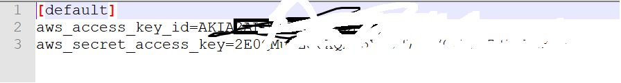
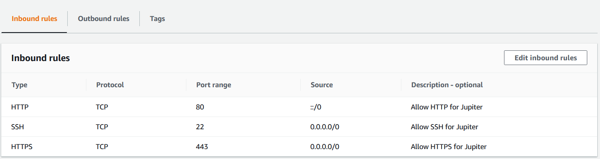
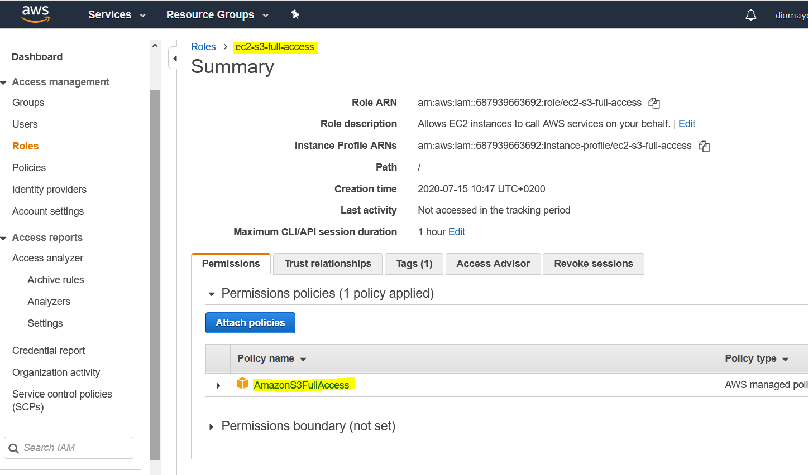
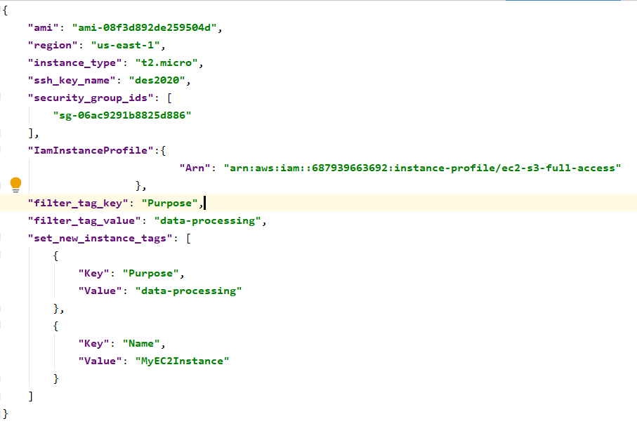

# Python > AWS automatic provisioning tool with python

* Launch EC2 instance
* Terminate EC2 instance
* Create S3 Buckets
* ...

#### Usage

 * `git clone https://github.com/bngom/AWS-Python-Automatic-Provisionning.git`
 * `cd AWS-Python-Automatic-Provisionning`
 * `pip install virtualenv` # You may need to add the installation folder into your PATH environment variable
 * `virtualenv pyaws`
 * `pyaws\Scripts\activate.bat`
 * `pip install -r requirements.txt`

#### Set up EC2 credentials
Create a directory `C:\Users\barth\.aws`
in the folrder `.aws` create a file `credentials` and edit it with you IAM credentials

#### Create a Security Group on EC2

#### Create a IAM Role

We will use this when we will create a **S3 Bucket**

#### The user data
In configs folder we have a file **_user-data_** with the following instructions to deploy at launch web server.
You can edit it if you want to perform specific actions.

`#!/bin/bash
yum update -y
yum install -y httpd.x86_64
systemctl start httpd.service
systemctl enable httpd.service
echo "Hello world from $(/sbin/ip -o -4 addr list eth0 | awk '{print $4}' | cut -d/ -f1)" > /var/www/html/index.html
`
#### The configuration
We created a JSON file to hold configuration data for our EC2 instance

* `ami: "ami-08f3d892de259504d"` is the id of an Amazon Linux 2 AMI (HVM), SSD Volume Type
* `region: "us-east-1"` the region where we would like to launch our instance
* `instance_type: "t2.micro"` the instance type
* `ssh_key_name: "des2020"` the name of a previously generated ssh key
* `security_group_ids: sg-06ac9291b8825d886` the security group id we created
* `IamInstanceProfile`: here we have specific information like **687939663692** which is your account id and **ec2-s3-full-access** the IAM role you created.

#### Launch an EC2 instance

You can launch an instance by executing the following command:

`python main.py
`

